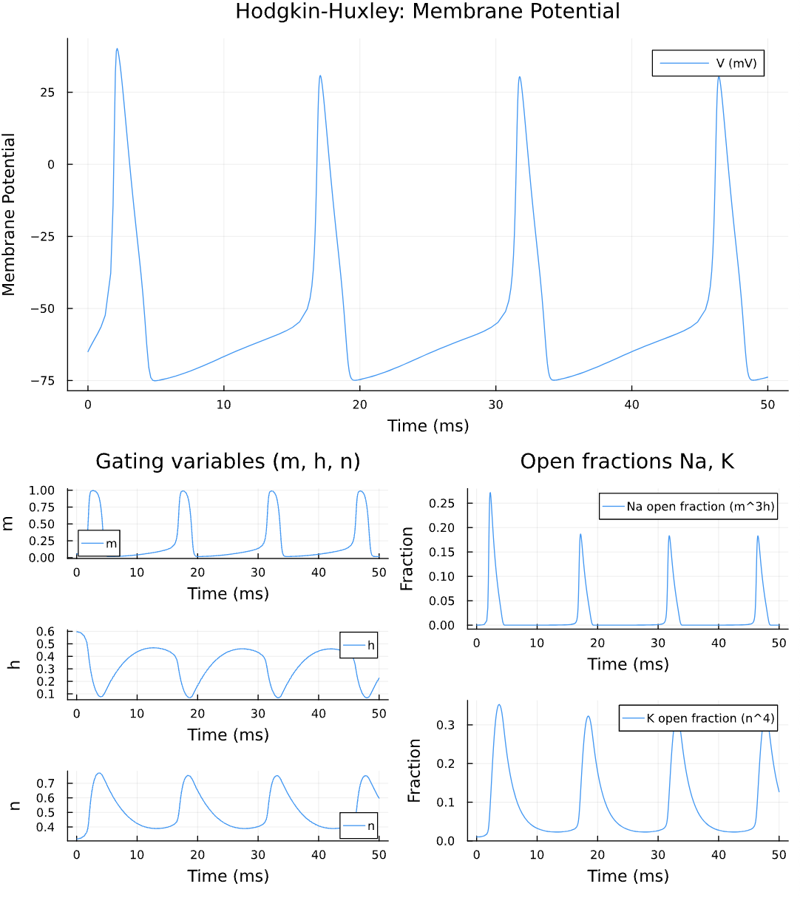

# o2c: computational neuroscience for Omics to Cognition research


A Julia package for computational neuroscience, focusing on ion channels, genomics and cognition.  

## Installation
To install the package, run:
```julia
using Pkg
Pkg.add(url="https://github.com/miro-ka/o2c")
```

## Included models & Equations
- Hodgkin-Huxley model
- Nerst Equation

## Examples


## Dev

### Run tests
To run the test suite, execute:
```
julia --project=. test/runtests.jl
```

### Run examples
To activate the environment and run example scripts:
```julia
using Pkg
Pkg.activate(".")
```

### Pull Requests
Before sending pull requests, ensure the new code is properly formatted. Use the following command:
```
julia --project=@. -e 'using JuliaFormatter; format(".", style=BlueStyle(), verbose=true)'
```
